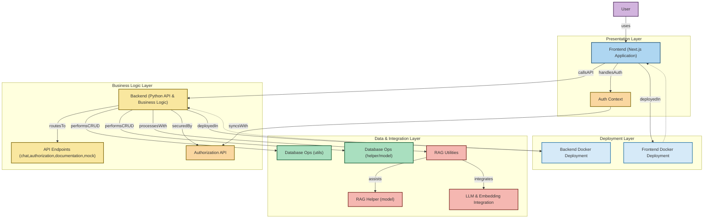

# FCU LLM

## 逢甲大學經濟學智能TA

### Feature
- [x] 班別系統 
- [x] 智能TA對話
- [x] 模擬考試
  - [x] 大一經濟學原理
  - [x] 公務員高普考
  - [x] 成績查詢
- [x] 教師上傳檔案
  - [ ] 標籤系統
- [ ] 學習目標選擇
  - [ ] 大一經濟學原理
  - [ ] 公務員高普考
- [x] 語言切換(i18n)

## Upload log

- 31/1/2025 
  - finished Mock Exam

## Backend .env File Documentation
### Development
| Parameter | Value |
| --------- | ----- |
| DEBUG     | True  |

### main.py
| Parameter           | Value |
| ------------------- | ----- |
| CORS_ALLOWED_ORIGIN |       |

### Database
| Parameter        | Value            |
| ---------------- | ---------------- |
| Debug            | True             |
| Host             | localhost        |
| User Name        | root             |
| Password         | example_password |
| Database         | FCU              |
| Port             | 3306             |
| Connection Retry | 3                |
| Root Username    | root             |
| Root Password    | example_password |

### Authentication
| Parameter | Value          |
| --------- | -------------- |
| Secret    | example_secret |
| Algorithm | HS256          |

### LLM and Embedding
| Deploy Mode           | Value                  |
| --------------------- | ---------------------- |
| LLM_DEPLOY_MODE       | openai                 |
| EMBEDDING_DEPLOY_MODE | text-embedding-3-small |

### AFS
| Parameter       | Value             |
| --------------- | ----------------- |
| API_URL         |                   |
| API_KEY         |                   |
| Model Name      | ffm               |
| Embedding Model | mxbai-embed-large |

### Ollama
| Parameter       | Value             |
| --------------- | ----------------- |
| Host            | http://localhost  |
| Port            | 11434             |
| Main Model      | llama3.2:3b       |
| Embedding Model | mxbai-embed-large |

### Openai
| Parameter  | Value                  |
| ---------- | ---------------------- |
| API_KEY    | <long string>          |
| Model Name | gpt-4o-mini            |
| Embedding  | text-embedding-3-small |

### Milvus
| Parameter        | Value     |
| ---------------- | --------- |
| Debug            | True      |
| Host             | localhost |
| Port             | 19530     |
| Vector Dimension | 1536      |

### Frontend .env file
| **Section** | **Variable**           | **Value**                    |
| ----------- | ---------------------- | ---------------------------- |
| **API URL** | NEXT_PUBLIC_API_URL    | http://localhost:8000/api/v1 |
|             | NEXT_PUBLIC_DEBUG_MODE | true                         |
